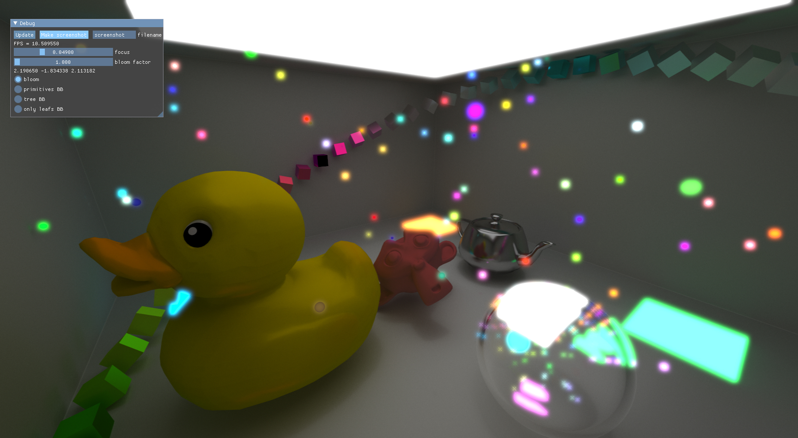

# Moon

# Vulkan Render

<p align="center"></p>

# Cuda Ray Tracing

<p align="center"></p>

## About

This repository contains a number of modules, that makes 3D render using [Vulkan API](https://www.vulkan.org/). All render moduls are implemented as static libraries and located in [core](core) directory, check READMEs in modules directories for more detailed information. Tests are located in [tests](tests) directory and implemented as executable applications, that demonstrate rendering functionality. Almost all build dependences could be cloning by [clone script](scripts/clone.py), for more build informations check [requirements](#Requirements) and [build](#Build-tests-applications) paragraphs.

Links to another readme:
* [Deferred Graphics](core/deferredGraphics/README.md)
* [Graphics Manager](core/graphicsManager/README.md)
* [Imgui Graphics](core/imguiGraphics/README.md)
* [Cuda Ray Tracing](core/rayTracingGraphics/README.md)

## Build tests applications
From working directory:
*   Pre build steps
    *   For clean `Ubuntu` you need install next libs:
        *   For GLFW build:
            ```
            sudo apt install libx11-dev
            sudo apt install libxrandr-dev
            sudo apt install libxinerama-dev
            sudo apt install libxcursor-dev
            sudo apt install libxi-dev
            sudo apt install mesa-common-dev
            ```
        *   Vulkan:
            ```
            sudo apt install vulkan-tools
            sudo apt install libvulkan-dev
            sudo apt install vulkan-validationlayers-dev spirv-tools
            ```
            You can check `Vulkan` with `vulkaninfo` and `vkcube` commands
    *   Clone dependences:
        *   Linux:
            ```
            ./scripts/clone.sh
            ```
        *   Windows
            ```
            ./scripts/clone.bat
            ```
*   Compile shaders
    *   Linux:
        ```
        ./scripts/shaders_compile.sh
        ```
    *   Windows
        ```
        ./scripts/shaders_compile.bat
*   Build:
    ```
    mkdir build
    cd build
    cmake .. -DCMAKE_BUILD_TYPE=Release -DCUDA_RAY_TRACING=ON
    cmake --build . --config Release
    ```
    Use `CUDA_RAY_TRACING` flag for build `cudaRayTracing` module and `testCuda` test, make shure you have installed `CUDA`, it is not installed with dependences by `clone.py` script.

## Requirements

A number of dependences that could be cloning by [clone script](scripts/clone.py):
* [stb](https://github.com/nothings/stb.git) - image loader
* [tinygltf](https://github.com/syoyo/tinygltf.git) - gltf model loader
* [tinyply](https://github.com/ddiakopoulos/tinyply.git) - ply model loader
* [vulkan headers](https://github.com/KhronosGroup/Vulkan-Headers.git) - Vulkan header files 
* [ImGui](https://github.com/ocornut/imgui.git) - open GUI library
* [glfw](https://github.com/glfw/glfw.git) - window API, automatically builded by script

Also you need installed `Vulkan API` and optional `CUDA`.

## Decription

At the moment, only deferred render (`deferredGraphics`) has been implemented. It's a stand-alone module that can be replaced with another implementation of render. In the future, it is planned to implement a simpler forward rendering as modul. Current implementation requires around 1.5-2 Gb of device memory for initialization and supporting all functionality.

All renders, for example `deferredGraphics`, `cudaRayTracing` or `imguiGraphics`, host by graphics manager (`graphicsManager`), that creates and supports all necessary stuff. Manager and render moduls communicats by linker classes, all instance of render moduls must implement oun linker class inherited from the linker interface.

`cudaRayTracing` is simpliest implementation of ray tracing, it has low perfomance. Possible in the future this modul will be improved. In current state it shows simultaneos `CUDA` and `Vulkan` work.

[ImGui](https://github.com/ocornut/imgui.git) was integrated as graphics modul `imguiGraphics`, and could be launched with other graphics modul. Generally speaking all graphics moduls could be launched simultaneosly, and show in different parts of window. Also, for example, two instance of graphics could be launched by single manager for multi-view presentation (`testPos`).

Supported models formats: gltf, glb, ply.
