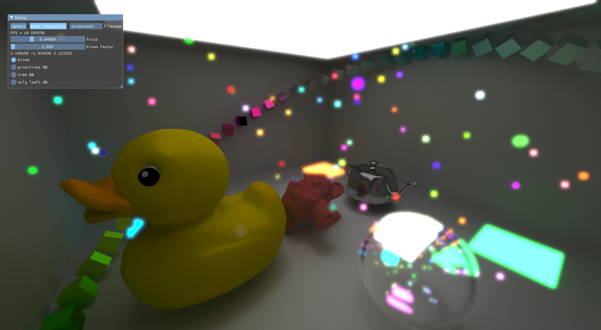
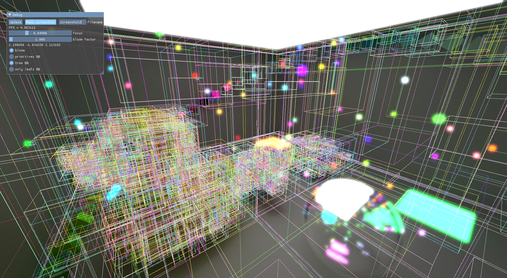

# Cuda Ray Tracing

This is the simplest example of raytracing implemented with `CUDA`. This example just show a one way of processing images with `CUDA` and "host" this process by `Vulkan`. The main render takes place in `rayTracingGraphics` and images are coped from device cuda memory to cpu memory and double coped to `Vulkan` device memory for linking with `graphicsManager`. `rayTracingLink` class connects `rayTracingGraphics` and `graphicsManager` by common link interface. Next steps don't depend on this modul and `graphicsManager` outputs images in swap chain.

# KD tree visualization

